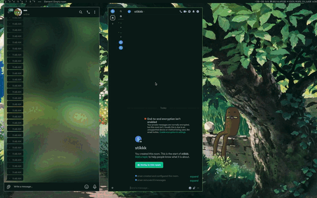

stikman brings platform independent stickers for the desktop


## Showcase (using telegram and element/matrix)


## Notes

apply [this](https://gitlab.com/sinanmohd/stikman/-/blob/master/nout-sxiv.patch) patch to sxiv or use the patched version [here](https://gitlab.com/sinanmohd/nsxiv) for a more seamless experience, it'll automatically quit sxiv after sticker selection

## Usage

* launch stikman using a key binding daemon like [sxhkd](https://wiki.archlinux.org/title/Sxhkd) and select a sticker using `m` or right click. additionally quit using `q` if you didint apply the [nout sxiv patch](https://gitlab.com/sinanmohd/stikman/-/blob/master/nout-sxiv.patch)

```
stikman install <pack.zip>      install sticker pack
stikman rm                      remove sticker pack
stikman view                    view sticker pack
stikman add     <image file>    add a new item to sticker pack 
stikman share                   get a shareable link for sticker pack
stikman rename                  rename a sticker pack
stikman fetch   <link>          install pack from a link 
stikman create  <directory>     make pack from images inside the directory
stikman help                    print this menu 
```

## Dependencies

* [`sxiv`](https://codeberg.org/nsxiv/nsxiv)
* [`dmenu`](https://tools.suckless.org/dmenu/)
* [`imagemagick`](https://imagemagick.org/index.php)
* [`xclip`](https://github.com/astrand/xclip)
* [`xdotool`](https://github.com/jordansissel/xdotool)

## Optional dependencies

* [`curl`](https://github.com/curl/curl) (for sharing and downloading sticker packs)
* [`zip`](http://www.info-zip.org/Zip.html) (for sharing sticker packs)
* [`unzip`](http://infozip.sourceforge.net/UnZip.html) (for installing sticker packs)

## FAQ

* how do i import telegram stickers ?

send telegram sticker link to any sticker downloader bot (eg: [@downloader_sticker_bot](https://t.me/downloader_sticker_bot), [@DownloadStickersBot](https://t.me/DownloadStickersBot)), download the zip file and install them using `stikman install file.zip`
